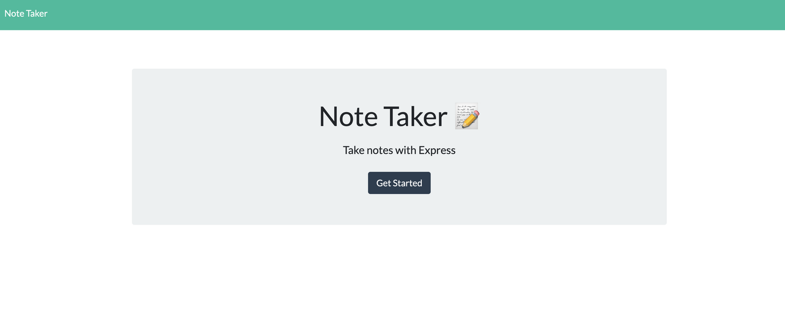
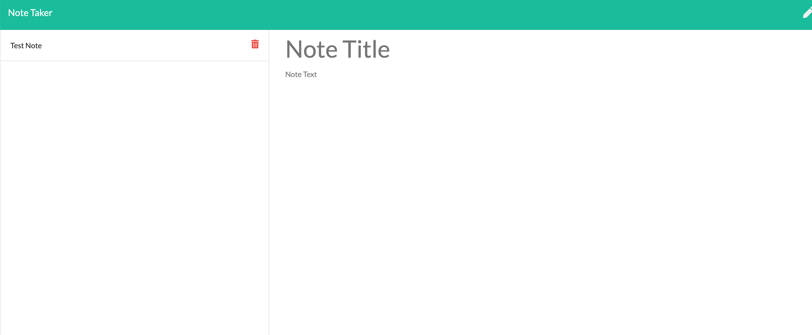

# Note Taker
This app allows the user to write notes for daily tasks. The user can add and delete notes as desired using a simple and easy to understand UI.

## Technology

The website was built using HTML, CSS and Javascript, FS and Express Node packages and deployed on Heroku. 

## Pages

Two responsive pages. The homepage contains a "Start" button that takes the user to the note taker page.

https://desolate-wildwood-45282.herokuapp.com/

## Contributing

Pull requests are welcome, but should be limited to improving the layout and styles. Must install Node JS packages FS and Express (or similar) and serve the page on Heroku or similar platform. 

## License

MIT
